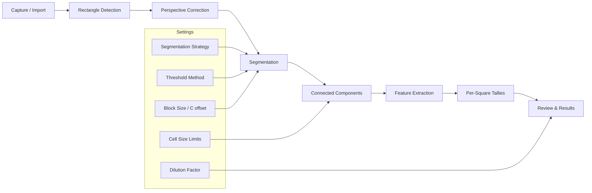

# Imaging Pipeline Diagram

- **Capture / Import**: `CaptureViewModel` or mock injection seeds raw images.
- **Rectangle Detection**: `ImagingPipeline.detectGrid` locates hemocytometer boundaries.
- **Perspective Correction**: `ImagingPipeline.perspectiveCorrect` normalizes orientation.
- **Segmentation**: `ImagingPipeline.segmentCells` (classical/CoreML) guided by Settings parameters.
- **Connected Components & Features**: `CellDetector` + helper functions compute areas, centroids, etc.
- **Per-Square Tallies**: `CountingService` maps objects to the Neubauer grid.
- **Review & Results**: `ReviewViewModel` draws overlays; `ResultsViewModel` calculates concentration/viability and exports artifacts.

Use this diagram alongside `docs/ARCHITECTURE.md` for the big-picture flow.
